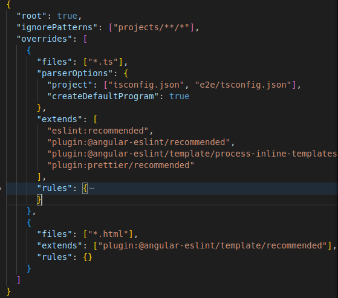

# Install guide

1. Install eslint
   - Install eslint: ng add @angular-eslint/schematics
   - Check eslint: ng lint --fix
   - Tạo file config cho eslint ở .eslintrc.json
   - Tạo file ignore cho eslint ở .eslintignore
2. Install prettier
   - npm install prettier --save-dev
   - Check prettier: npx prettier --write .
   - Tạo file config cho prettier ở .prettierrrc.json
3. Add prettier to eslint config
   -  npm install prettier-eslint eslint-config-prettier eslint-plugin-prettier --save-dev
   - Add plugin prettier cho eslint:
   
   
4. Install husky
   - npm install husky --save-dev
   - npm install --save-dev pretty-quick husky   
   - npx husky-init
5. Install commitlint
   - npx husky add .husky/commit-msg 'npx --no-install commitlint --edit'
   - npm install @commitlint/config-conventional @commitlint/cli --dev
   - Tạo file config cho commitlint .commitlintrc.json
   - (for more information about convention message: https://github.com/angular/angular/blob/22b96b9/CONTRIBUTING.md#-commit-message-guidelines)

